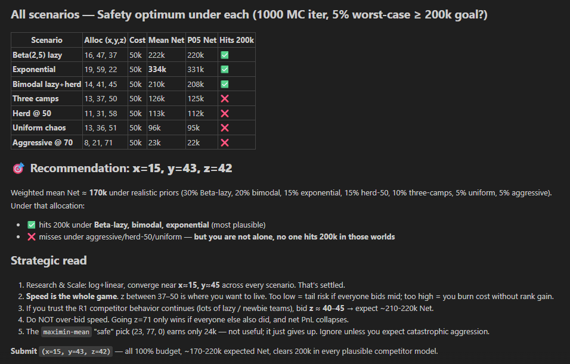

# 📈 IMC Prosperity 4 Trading Suite

A unified repository for strategy development, backtesting, and analysis, currently optimized for **Round 2**.

---

## 🏗️ Project Layout

- **`ROUND 2/`**: Active development workspace containing traders, configurations, and results.
- **`ROUND 1/`**: Legacy data and strategies for reference.
- **`tools/dashboard.py`**: The main entry point for the visual console.
- **`tools/run_rust_backtester.py`**: One command to build and run the vendored Rust backtester against Round 2 capsule data.
- **`tools/impl/`**: Core implementation of the Unified Dashboard.
- **`requirements-dashboard.txt`**: Python dependencies for the Streamlit dashboard (install once from the repo root).
- **`backtester/`**: High-performance [Rust backtester](https://github.com/GeyzsoN/prosperity_rust_backtester) (primary testing engine).
- **`run_backtest.ps1` / `.sh`**: Convenient wrapper scripts for the Rust backtester (handles Windows/WSL pathing).
- **`tools/manual_optimiser/`**: Advanced multi-scenario optimization for Round 2 manual challenges.
- **`archive/`**: Retired rounds, legacy backtesters, and secondary tools.
- **`assets/`**: Visual assets and documentation images.

---

## 🚀 Getting Started

### 1. Python environment

From the repo root (use a venv if you like):

```bash
python -m venv .venv
.venv\Scripts\activate
pip install -r requirements-dashboard.txt
```

That file includes **matplotlib** (used by pandas `Styler.background_gradient` on the Robust Analysis comparison tables). If you skip reinstall after a pull, run `pip install -r requirements-dashboard.txt` again.

On PowerShell, paths that contain spaces must be quoted.

### 2. Launch the Operations Console (Streamlit)

```bash
streamlit run "tools/dashboard.py"
```

Or:

```bash
python -m streamlit run "tools/dashboard.py"
```

**Verified:** With dependencies installed, `tools/impl/unified_dashboard.py` imports cleanly and the app entrypoint is `tools/dashboard.py`.

The UI defaults to **Round 2**; use the sidebar to switch rounds. The Robust Analysis tab reads CSVs from `ROUND N/results/robust/` (IMC-focused metrics by default).

### 3. High-Performance Rust Backtester (Primary)

The primary backtester is a Rust-based engine located in `external/prosperity_rust_backtester/`.

#### Windows Setup
You need **`cargo`** on your PATH.
*   **WSL2 (Recommended):** Best performance and easiest setup.
*   **Native Windows:** Requires the MSVC linker (Visual Studio Build Tools).

#### Launchers
We provide multiple ways to run the backtester from the repo root:

**A. One-command Python launcher (cross-platform):**
```powershell
python "tools/run_rust_backtester.py"
```
*Builds the binary if needed and runs against Round 2 data by default.*

**B. PowerShell wrapper (WSL optimized):**
```powershell
.\run_backtest.ps1 -dataset tutorial
```
*Handles path conversion to WSL automatically.*

#### Usage Examples
```powershell
# Run tutorial data
.\run_backtest.ps1 -dataset tutorial

# Run latest Round 2 trader on Round 2 data
python "tools/run_rust_backtester.py" --trader "ROUND 2/traders/peter/trader_peter_v2001.py" --dataset "ROUND 2/data_capsule"

# Passing extra flags to the Rust binary
python "tools/run_rust_backtester.py" -- --day -1
```


### 4. Real-world market fetcher (off by default)

`ROUND 1/tools/real_data_fetcher.py` and `ROUND 2/tools/real_data_fetcher.py` **do not** call yfinance / Alpha Vantage unless you set:

PowerShell:

```powershell
$env:IMC_PROSPERITY_ALLOW_REAL_FETCH = "1"
python "ROUND 2/tools/real_data_fetcher.py"
```

bash:

```bash
export IMC_PROSPERITY_ALLOW_REAL_FETCH=1
python "ROUND 2/tools/real_data_fetcher.py"
```

Use `python "ROUND 2/tools/real_data_fetcher.py" --list` to inspect local cache without network access.

### 5. Legacy Backtesting (Removed)

Legacy Python scripts (`robust_backtester.py`) have been removed in favor of the Rust engine. If you need to comparison-test against old logs, check the `archive/` or use the **Robust Analysis** tab in the dashboard.

---

## 🛡️ Manual Challenge Strategy (Round 2)

The **Manual Optimizer** (integrated into the dashboard) helps compute the optimal allocation of your 50,000 XIRECs budget across Research, Scale, and Speed.

### Visual Reference




### Current Recommendation

- **Target Allocation**: `x=15` (Research), `y=43` (Scale), `z=42` (Speed)
- **Expected Net PnL**: ~170k - 220k XIRECs.
- **Strategic Insight**:
  - Research & Scale converge predictably near `x=15`, `y=45`.
  - **Speed (z)** is the deciding factor. Values between 37–50 are optimal. Bidding too low introduces tail risk; bidding too high (e.g., `z=71`) burns budget without significant rank gain if competitors are aggressive.
  - This allocation clears the **200k target** in every plausible competitor model (Beta-lazy, Bimodal, Exponential).

---

## 🛠️ Contributing / New Rounds

1. Use the templates in `archive/ROUND_TEMPLATE` if starting fresh.
2. Add data under `ROUND X/data_capsule/` and strategies under `ROUND X/traders/`.
3. The Unified Dashboard will automatically detect the new `ROUND X` folder.
