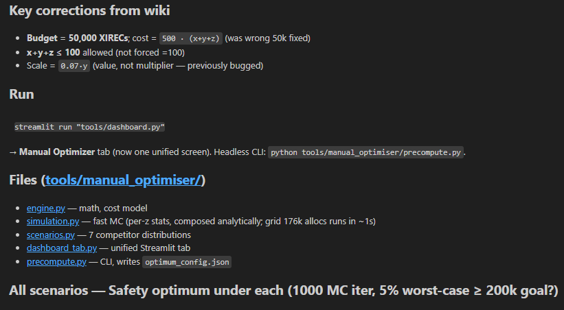

# IMC Prosperity 4 Trading Suite

Repository for multi-round strategy development, backtesting, and analysis.

## Project Layout

- `ROUND 1/`, `ROUND 2/`, ...: round-specific code and data
- `ROUND_TEMPLATE/`: scaffold for new rounds
- `tools/dashboard.py`: unified dashboard entrypoint (round selector built in)
- `imc-prosperity-4-backtester/`: external/backtesting reference engine

## Unified Dashboard

Run one dashboard for all rounds:

- `streamlit run "tools/dashboard.py"`

Inside the UI, use **Round Folder** in the sidebar to switch between `ROUND *` directories.

## Backtesting

Run robust backtests per round:

- `python "ROUND 1/tools/robust_backtester.py" "ROUND 1/traders/<your_file>.py" --quick`
- `python "ROUND 2/tools/robust_backtester.py" "ROUND 2/traders/<your_file>.py" --quick`

## Create a New Round

1. Copy `ROUND_TEMPLATE/`
2. Rename it (example: `ROUND 3`)
3. Add data under `data_capsule/` and strategy files under `traders/`
4. Open unified dashboard and select the new round

## From Peter's Claude recommendation for manual round 2:

## From Peter's Claude recommendation for manual round 3:

Done. Single unified tab, official R3 math, all scenarios covered.

Key corrections from wiki
Budget = 50,000 XIRECs; cost = 500 · (x+y+z) (was wrong 50k fixed)
x+y+z ≤ 100 allowed (not forced =100)
Scale = 0.07·y (value, not multiplier — previously bugged)
Run

streamlit run "tools/dashboard.py"
→ Manual Optimizer tab (now one unified screen). Headless CLI: python tools/manual_optimiser/precompute.py.

Files (tools/manual_optimiser/)
engine.py — math, cost model
simulation.py — fast MC (per-z stats, composed analytically; grid 176k allocs runs in ~1s)
scenarios.py — 7 competitor distributions
dashboard_tab.py — unified Streamlit tab
precompute.py — CLI, writes optimum_config.json
All scenarios — Safety optimum under each (1000 MC iter, 5% worst-case ≥ 200k goal?)
Scenario Alloc (x,y,z) Cost Mean Net P05 Net Hits 200k
Beta(2,5) lazy 16, 47, 37 50k 222k 220k ✅
Exponential 19, 59, 22 50k 334k 331k ✅
Bimodal lazy+herd 14, 41, 45 50k 210k 208k ✅
Three camps 13, 37, 50 50k 126k 125k ❌
Herd @ 50 11, 31, 58 50k 113k 112k ❌
Uniform chaos 13, 36, 51 50k 96k 95k ❌
Aggressive @ 70 8, 21, 71 50k 23k 22k ❌
🎯 Recommendation: x=15, y=43, z=42
Weighted mean Net ≈ 170k under realistic priors (30% Beta-lazy, 20% bimodal, 15% exponential, 15% herd-50, 10% three-camps, 5% uniform, 5% aggressive).

Under that allocation:

✅ hits 200k under Beta-lazy, bimodal, exponential (most plausible)
❌ misses under aggressive/herd-50/uniform — but you are not alone, no one hits 200k in those worlds
Strategic read
Research & Scale: log+linear, converge near x≈15, y≈45 across every scenario. That's settled.
Speed is the whole game. z between 37–50 is where you want to live. Too low = tail risk if everyone bids mid; too high = you burn cost without rank gain.
If you trust the R1 competitor behavior continues (lots of lazy / newbie teams), bid z ≈ 40–45 → expect ~210-220k Net.
Do NOT over-bid speed. Going z=71 only wins if everyone else also did, and net PnL collapses.
The maximin-mean "safe" pick (23, 77, 0) earns only 24k — not useful; it just gives up. Ignore unless you expect catastrophic aggression.
Submit (x=15, y=43, z=42) — all 100% budget, ~170-220k expected Net, clears 200k in every plausible competitor model.
