<div align="center">

</div>

# IMC Prosperity 4 - Team Pixelers

Our full run through **IMC Prosperity 4**: a 5-round algorithmic + manual trading
competition across the planets **Intara**, **Solvenar**, and **Ignith**.

## Final result

| Leaderboard | Rank |
|-------------|------|
| **Overall** | **#1521** |
| Algorithmic | #3085 |
| Manual | #348 |
| Country | #127 |

**Final PnL: 141,726 XIRECs.** Manual trading was our edge all competition - top-350
manual finish versus a mid-pack algo. Round 1 manual placed **1st in the world**.


## Team

| Member |
|--------|
| Peter Ma |
| Viet Duc Tran |
| Suvin Chin Chandran |
| Siddhant Malik |
| Adin Sreekesh |

## Results at a glance

> Round 3 was a hard leaderboard reset ("Gloves off") - the running total restarts there.

| Rd | Planet | Final algo (author) | Algo PnL | Manual PnL | Round total | Running | Position |
|----|--------|---------------------|---------:|-----------:|------------:|--------:|---------:|
| 1 | Intara | `128-trader_robust_peter_v12.py` (Peter) | +85,640 | **+87,995** | 173,636 | 173,636 | **1872nd** |
| 2 | Intara | `138-Holy_grailllll.py` (Peter) | +81,187 | +24,233 | 105,420 | 279,056 | 3291st |
| 3 | Solvenar* | `107-chefclaude.py` (Viet Duc) | −5,452 | +79,622 | 74,170 | 74,170 | 2185th |
| 4 | Solvenar | `35-pot.py` (Suvin) | +16,536 | +54,821 | 71,357 | 145,527 | 1207th |
| 5 | Solvenar/Ignith | `69-heaven_we_comingv8.py` (Viet Duc) | −80,338 | +76,537 | −3,801 | 141,726 | **1521st** |

\* leaderboard reset before Round 3.

---

## Round by round

### Round 1 - Intara: "First Intarian goods"
First two goods: **Ash-coated Osmium** and **Intarian Pepper Root**. Position **1872nd**.

- **Algo:** `128-trader_robust_peter_v12.py` (Peter Ma) → **+85,640** (rank 3030)
- **Manual:** one-shot stale-orderbook auction → **+87,995, ranked 1st in the world**
  - Dryland Flax: BUY 9,999 @ 30 → +9,999
  - Ember Mushroom: BUY 19,999 @ 20 → +77,996

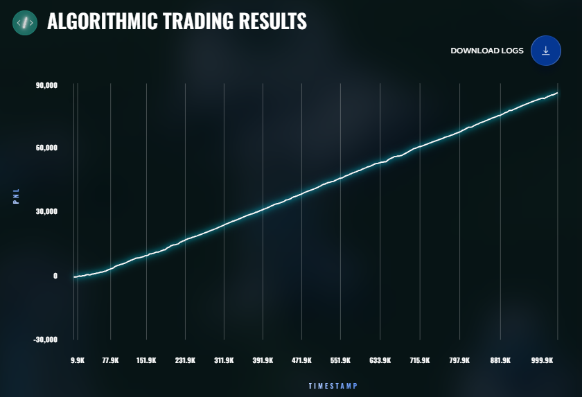
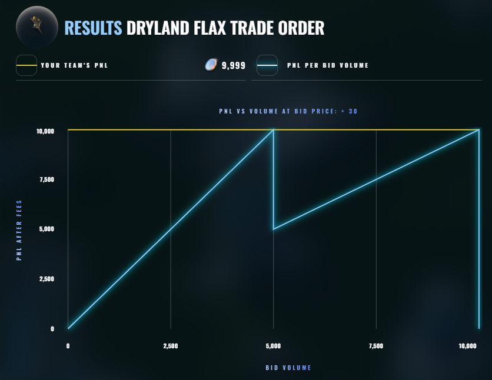
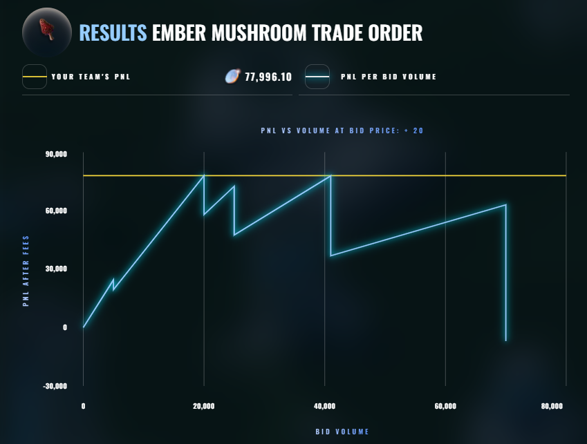

### Round 2 - Intara: "Limited Market Access"
Market Access Fee mechanic + the **Invest & Expand** budget challenge. Hit the 200k
mission goal. Position **3291st**.

- **Algo:** `138-Holy_grailllll.py` (Peter Ma) → **+81,187** (rank 2693)
- **Manual:** invested 50,000 budget - Research 23% / Scale 77% / Speed 0% → **+24,233** (rank 736)

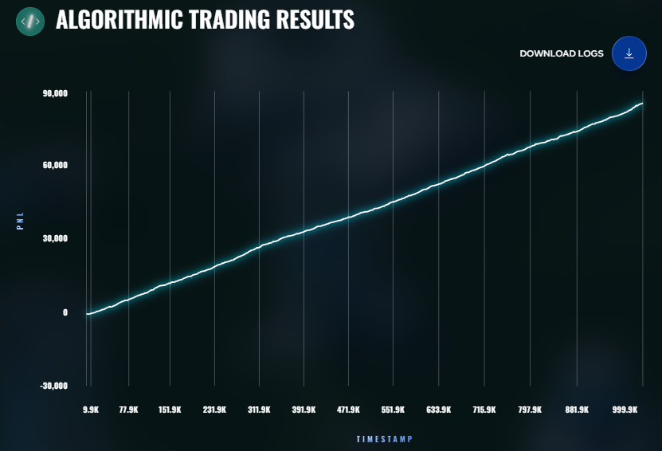
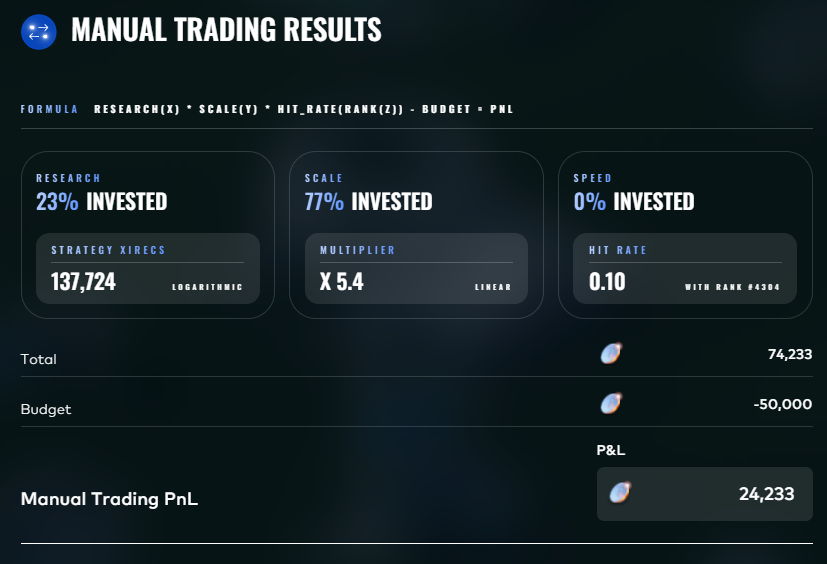
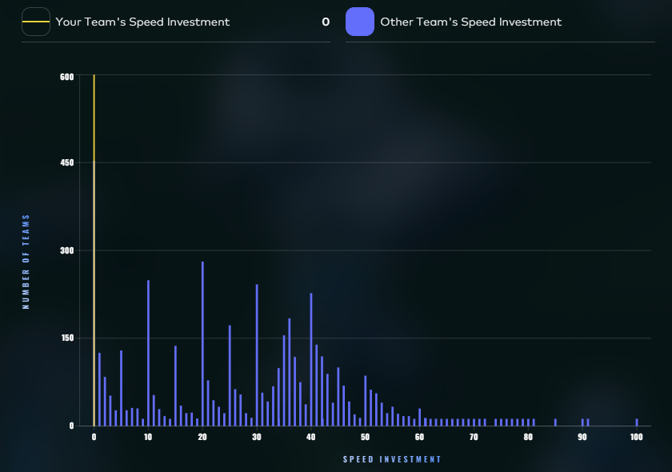

### Round 3 - Solvenar: "Options require decisions" *(leaderboard reset)*
New goods: **Hydrogel Packs**, **Velvetfruit Extract**, and Velvetfruit Extract
Vouchers (options). Position **2185th**.

- **Algo:** `107-chefclaude.py` (Viet Duc Tran) → **−5,452** (rank 2702)
- **Manual:** Celestial Gardeners' Guild bids 766 / 866 → **+79,622** (rank 22)

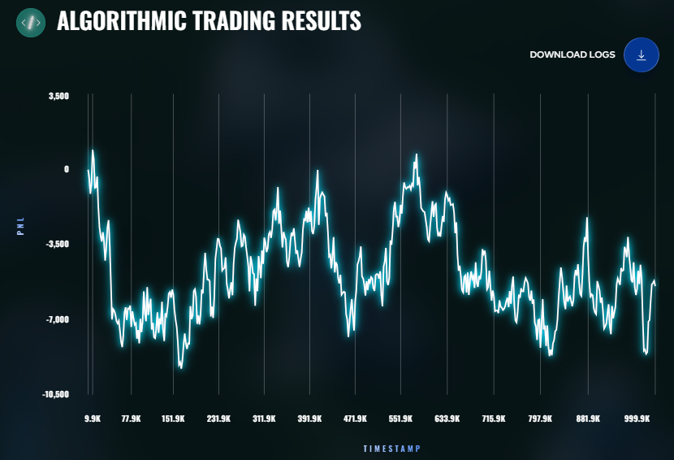
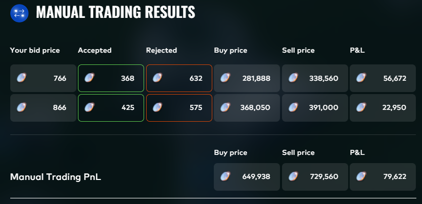
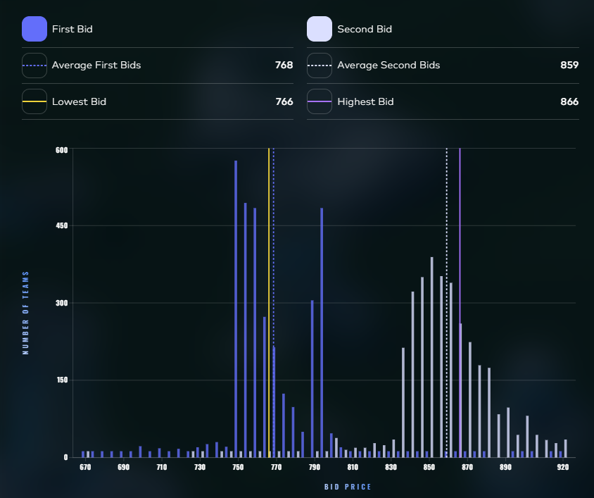

### Round 4 - Solvenar: "Hello, I'm Mark"
Counterparty IDs ("Mark N") added to the data; re-evaluate the VEV options book.
Position **1207th**.

- **Algo:** `35-pot.py` (Suvin Chin Chandran) → **+16,536** (rank 1353)
- **Manual:** Aether Crystal exotic options (puts/calls/chooser/binary/knock-out) → **+54,821** (rank 344)

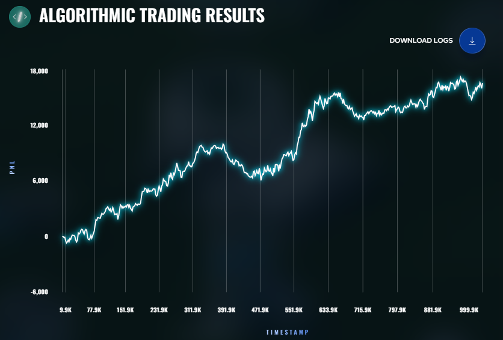
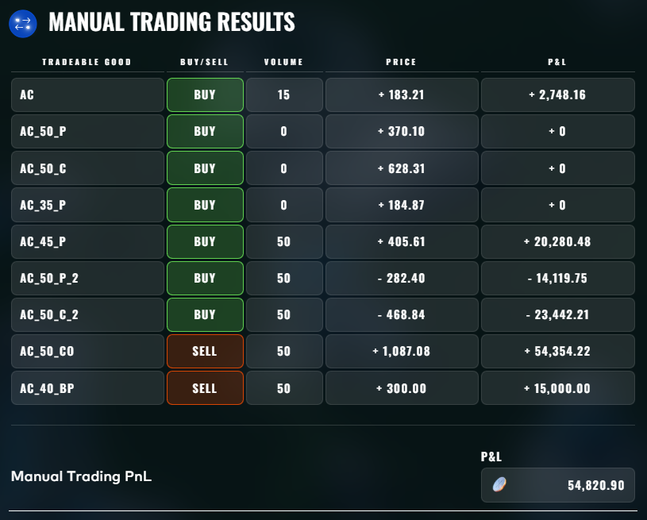
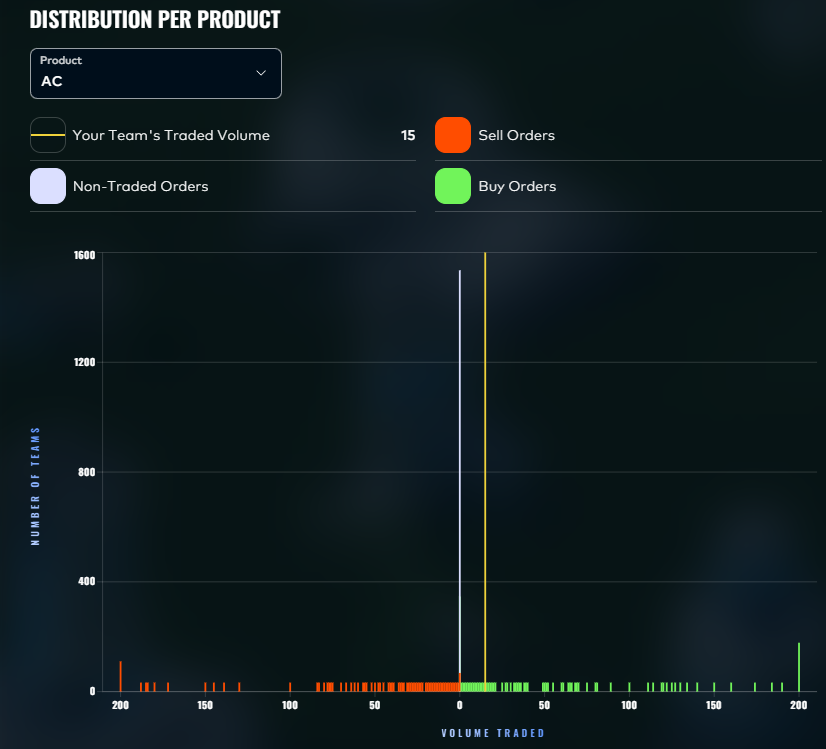

### Round 5 - Solvenar + Ignith: "The final stretch"
50 new goods, plus a one-time manual market on the neighbouring planet **Ignith**
(1,000,000 budget, "Ashflow Alpha" news). Position **1521st**.

- **Algo:** `69-heaven_we_comingv8.py` (Viet Duc Tran) → **−80,338** (rank 1700)
- **Manual:** Ignith market basket (Thermalite/Magma ink/Sulfur reactor long; Obsidian
  cutlery/Lava cake/Ashes of the Phoenix short, etc.) → **+76,537** (rank 691)

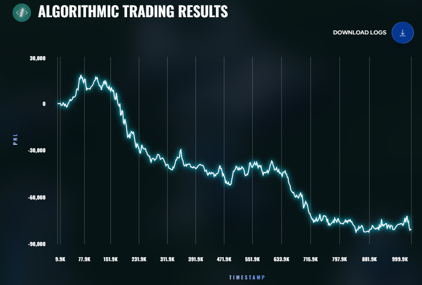
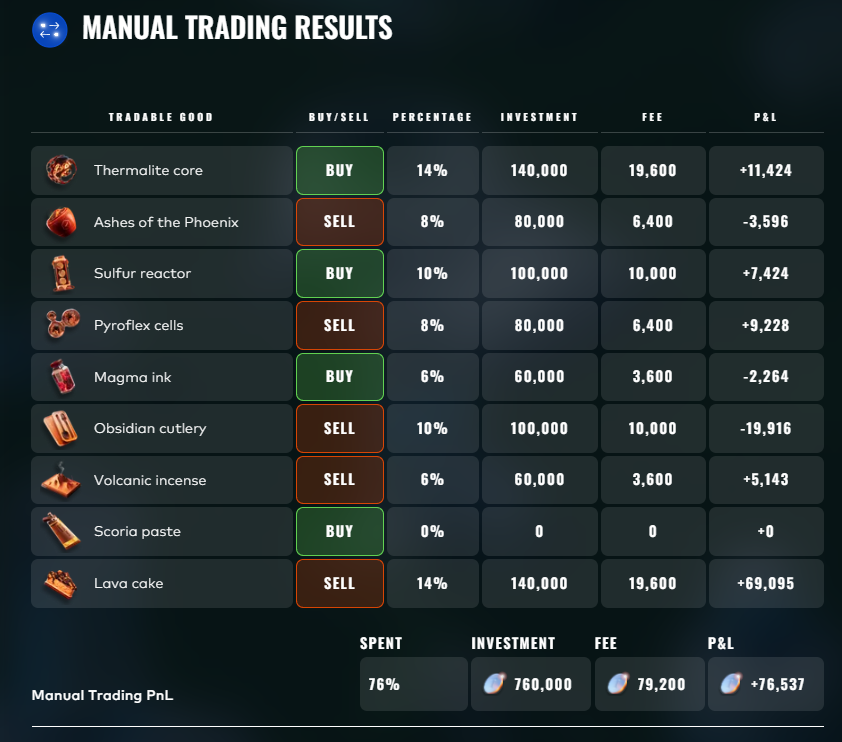

---

## What worked

- **Manual challenges carried us** - final manual rank #348 vs algo #3085. Round 1
  manual won the world; Round 3 manual placed 22nd.
- **Consistent algo market-making** on the simple goods (Rounds 1–2) banked steady PnL.
- The **options rounds (3–5) were rough** on the algo side - the exotic VEV/Aether
  books and the 50-good final round dragged the algorithmic score down.

## Repository structure

```
ROUND 1..5/     Per-round work, each with:
  traders/        strategies, by author (peter, ken, adin, suvin, sid, ...)
  data_capsule/   provided price/trade data (+ slices/)
  scratch/        experiments and analysis scripts
  docs/           round notes
  results/        backtest outputs
  live_logs/      competition run logs
  manual_trade/   manual-challenge working
tools/          backtester launchers, dashboard, analysis scripts
scripts/        run_backtest / run_prosperity4bt shell + ps1 launchers
visualizer/     PnL compare web app (html + js)
lib/            shared datamodel.py
external/       Rust backtester engine (submodule)
archive/        old code, templates, and the previous README
docs/results/   screenshots used in this README
```

## Running things

For backtester commands, the dashboard, and the visualizer, see the original dev notes
in [archive/README_old.md](archive/README_old.md).
