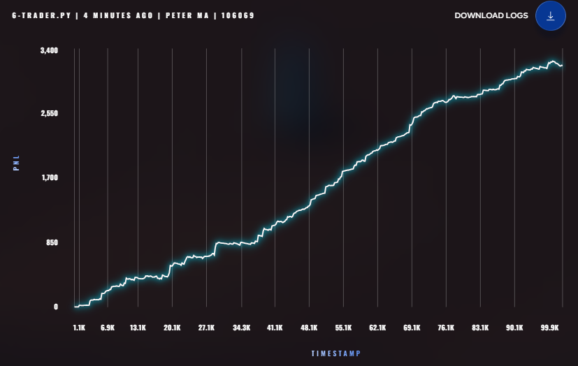
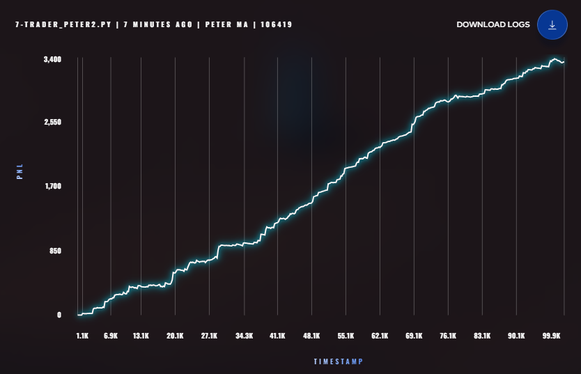
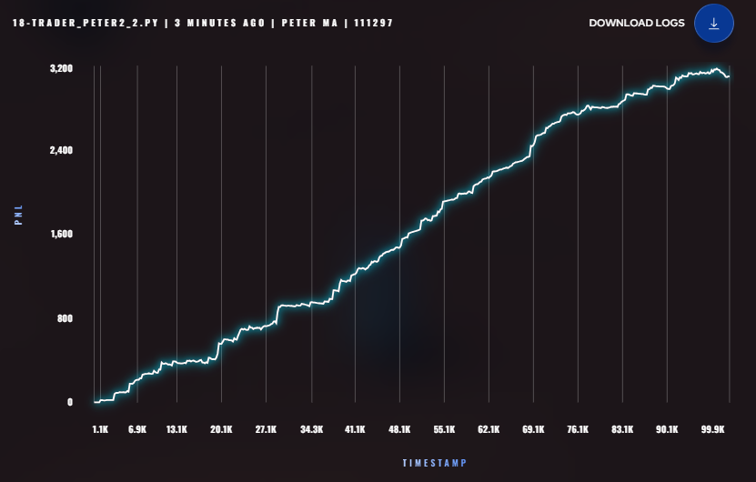
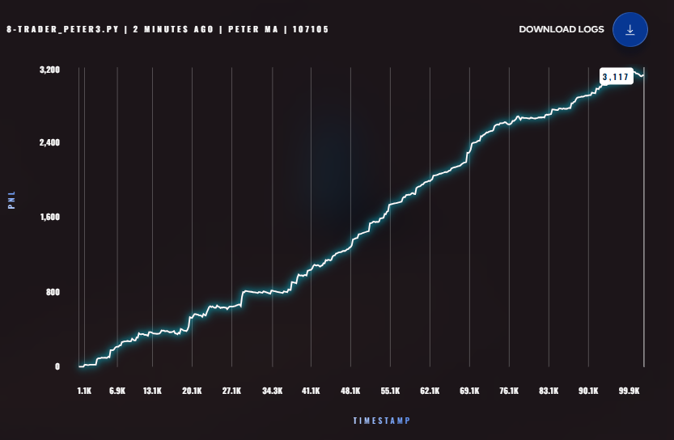
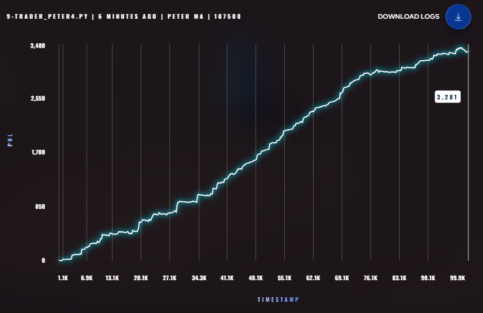
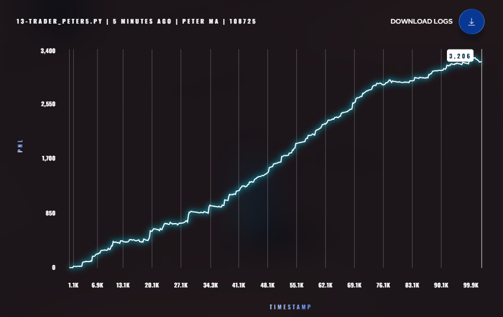
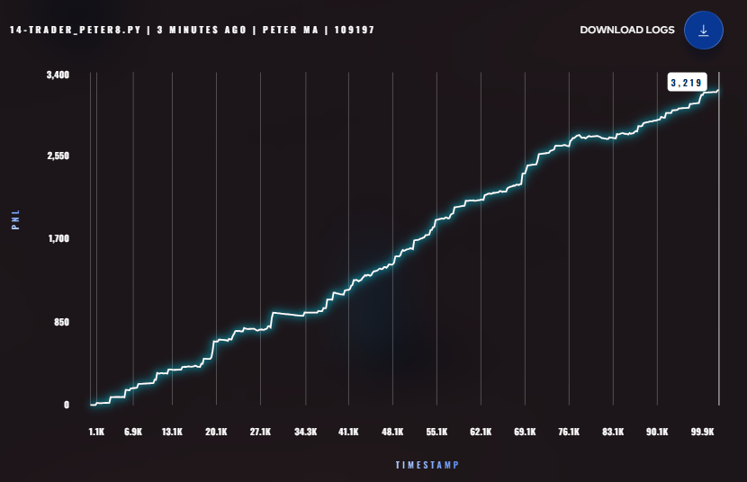
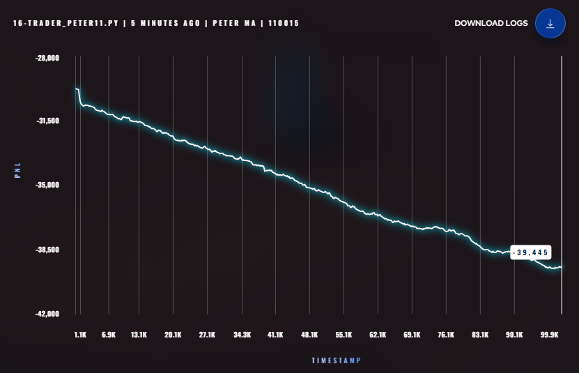

# 📊 Round 1 Strategy Audit: Scylla vs Charybdis
## OLD
# trader_peter.py 

# trader_peter2.py 

# trader_peter2_1.py 

# trader_peter2_2.py 

# trader_peter3.py 

# trader_peter4.py 

# trader_peter5.py 

# trader_peter6.py 

# trader_peter7.py 

# trader_peter8.py 

# trader_peter10.py 

# trader_peter11.py 
## NEW
# trader_peter3.py got ~8k

---

## 🏁 Summary Table (Original Audit)

| Strategy         | Total PnL (Backtest) | Day -2  | Day -1  | Day 0   | Profile                      |
| :--------------- | :------------------- | :------ | :------ | :------ | :--------------------------- |
| **Layered MM**   | **+$49,618**         | +$18.2k | +$12.9k | +$18.4k | **Aggressive / High Volume** |
| **Simple Penny** | **+$24,418**         | +$2.6k  | +$16.3k | +$5.4k  | Conservative / Maker-focused |
| **Fixed Anchor** | **-$86,657**         | -$21.7k | -$26.2k | -$38.6k | High Risk / Drift Victim     |

---

## 🔍 Strategy Deep-Dives

#### 🥈 1. `trader_peter.py` ($3,177 Baseline)

- **Concept**: EMA-based Mean Reversion.
- **Verdict**: Too slow for the drifting Starfruit components.

#### 🥇 2. `trader_peter2.py` ($3,340 Leader)

- **Concept**: **3-Lag Regression**.
- **Verdict**: The most robust signal discovered so far, but limited by the 20-unit position cap.

#### ✨ 2_1. `trader_peter2_1.py` ($3,400 Optimized)

- **Concept**: **Tape-Aware Regression**.
- **Verdict**: Improved fill quality using Trade Pressure (OFI), but confirmed that the exchange is likely hard-capping positions at 20 units for this round.

#### ⚡ 2_2. `trader_peter2_2.py` ($3,101 - Hyper-Pennying)

- **Concept**: **High-Frequency Aggression**.
- **Verdict**: Underperformed expectations. The tighter spread and aggressive skew caused too much "toxic volume" despite the higher theoretical fill rate.

#### 🥉 3. `trader_peter3.py` ($3,100 - Multi-Layer)

- **Concept**: 3-Layered Liquidity + OFI adjustment.
- **Verdict**: Good volume, but deeper layers were rarely filled.

#### 📈 4. `trader_peter4.py` ($3,248 - Micro-Price)

- **Concept**: 5-Lag Micro-price Regression.
- **Verdict**: Stable but slightly too conservative.

#### 🏎️ 6. `trader_peter6.py` ($300 PnL)

- **Concept**: 4-Lag Regression + Low Skew.
- **Verdict**: Failed to capture mean reversion correctly due to loose inventory control.

#### 🛡️ 7. `trader_peter7.py` (WIPE OUT)

- **Concept**: Market Take Stop-Loss.
- **Verdict**: Whipsawed to death.

#### 📉 10. `trader_peter10.py` ($1,600 - Signal Mismatch)

- **Concept**: Tape-Aware Fragmented MM.
- **Verdict**: Signal swap error (Anchored volatile, regressed steady).

#### 🌋 11. `trader_peter11.py` (-40,000 WIPE OUT)

- **Concept**: Final "XIREC Target" Attempt.
- **Verdict**: Full Signal Swap catastrophe. Anchored Starfruit during 500-tick drift.

---

## 🚀 Future Strategy

We are returning to the **v2_1** core logic but exploring **Fragmented Quoting** to dodge adverse selection while maintaining the 20-unit cap.
